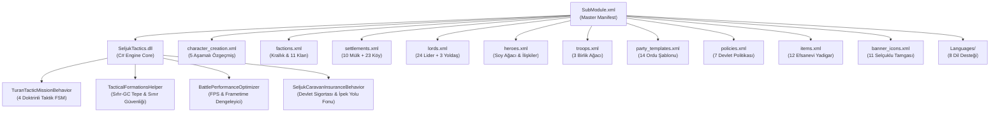
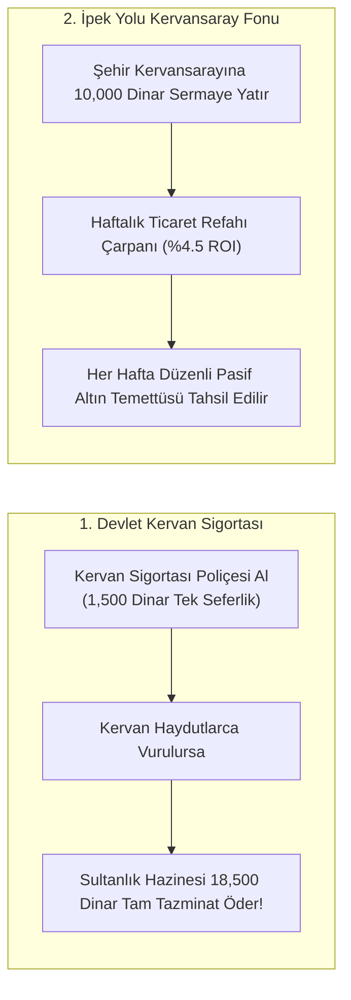
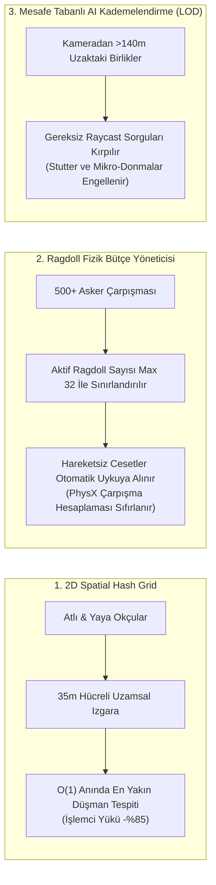
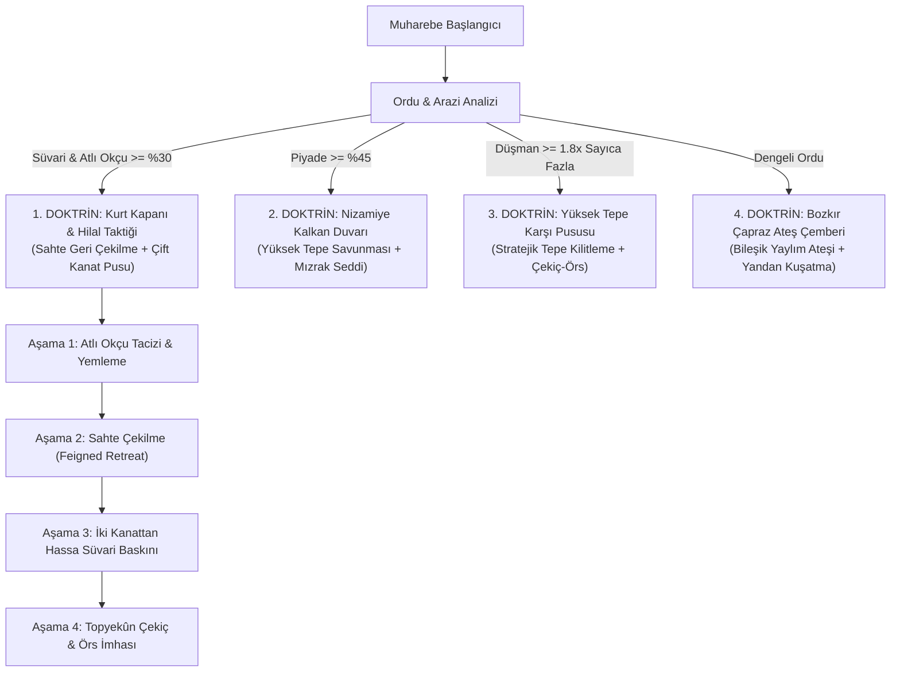
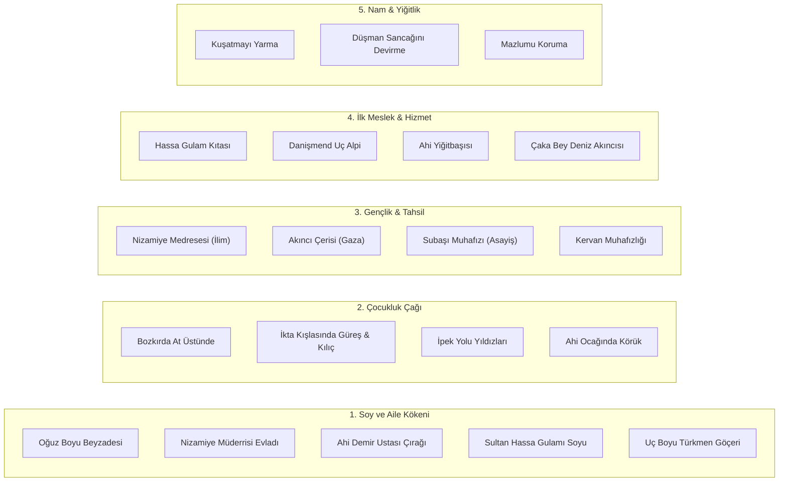
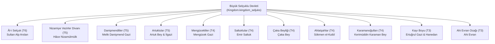

# Seljuk Empire: Sword of Islam — Mod Mimari & Bağlantı Grafiği (Architecture Graph)

Bu doküman, **"Seljuk Empire: Sword of Islam"** total conversion modundaki tüm modüllerin, C# çok doktrinli taktik yapay zeka motorunun, BattlePerformanceOptimizer FPS sisteminin, **Selçuklu Kervan Devlet Sigortası & İpek Yolu Kâr Ortaklığı sisteminin**, krallık, klan, lord, yerleşke, birlik ağaçları, karakter yaratma özgeçmişleri, eşyalar, politikalar ve diller arasındaki ilişkileri detaylandırmaktadır.

---

## 🏗️ 1. Genel Modül & Dosya Bağımlılık Haritası (Master Engine Architecture)

---

## 🪙 2. Selçuklu Kervan Devlet Sigortası & İpek Yolu Kâr Ortaklığı (Economy Engine)

---

## ⚡ 3. Savaş Alanı FPS & Ragdoll Optimizasyon Motoru (BattleOptimizer)

---

## 🏹 4. Çok Doktrinli Selçuklu Taktik Yapay Zeka Motoru (Multi-Doctrine AI)

---

## 👤 5. Selçuklu Karakter Yaratma Özgeçmiş Aşamaları

---

## 👑 6. Krallık, Beylikler ve Tarihi Liderler Hiyerarşisi

---

## 🗺️ 7. Şehirler, Kaleler ve Bağlı Köylerin Mülkiyet Dağılımı

| Yerleşke Türü | Yerleşke Adı | Sahibi Olan Klan | Bağlı Köyler & Özel Üretim |
| :--- | :--- | :--- | :--- |
| **Şehir (Town)** | **Konya (town_K1)** | Âl-i Selçuk (Alp Arslan) | Sille (Tahıl), Akşehir (Zeytin), Ladik (Koyun) |
| **Şehir (Town)** | **Sivas (town_K4)** | Âl-i Selçuk (Melikşah) | Zara (Demir), Kangal (At), Yıldızeli (Tahıl) |
| **Şehir (Town)** | **Kayseriyye (town_ES4)** | Danişmendliler (Danişmend) | Develi (Deri), Erciyes Ovası (Kürk), Talas (İpek) |
| **Şehir (Town)** | **Diyarbekir (town_ES2)** | Artuklular (Artuk Bey) | Ergani (Bakır), Silvan (İpek), Bismil (Pamuk) |
| **Şehir (Town)** | **Erzurum (town_K6)** | Saltuklular (Emir Saltuk) | Pasinler (Savaş Atı), Tortum (Meyve), Oltu (Mücevher) |
| **Şehir (Town)** | **Alâiye (town_A4)** | Çaka Beyliği (Çaka Bey) | Manavgat (Zeytinyağı), Gazipaşa (Tuz/Balık), Anamur (Kereste) |
| **Kale (Castle)** | **Divriği Kalesi (castle_K2)**| Mengücekliler (Mengücek) | Çetinkaya Madeni (Çelik/Demir), Kemaliye (Üzüm) |
| **Kale (Castle)** | **Ahlat Kalesi (castle_K5)** | Ahlatşahlar (Sökmen) | Erciş (Balık), Adilcevaz (Ceviz) |
| **Kale (Castle)** | **Malazgirt Kalesi (castle_K1)**| Ahlatşahlar (Sökmen) | Bulanık (Savaş Atı), Patnos (Tahıl) |
| **Kale (Castle)** | **Korykos Kalesi (castle_A8)**| Çaka Beyliği (Çaka Bey) | Silifke (Zeytin), Erdemli (Tuz) |
