# Seljuk Empire: Sword of Islam — Mod Mimari & Bağlantı Grafiği (Architecture Graph)

Bu doküman, **"Seljuk Empire: Sword of Islam"** total conversion modundaki tüm modüllerin, C# çok
doktrinli **reaktif** taktik yapay zeka motorunun (artık sabit senaryo değil, `Formation.
QuerySystem`'den her tick canlı muharebe verisi okuyan paylaşılan bir karar katmanı —
`TacticalSituationAssessor`, 43 birim testiyle), BattlePerformanceOptimizer FPS sisteminin (tarla
savaşları VE kuşatmalar), **Selçuklu Kervan Devlet Sigortası & İpek Yolu Kâr Ortaklığı sisteminin**,
8 krallığın (Selçuklu + 7 rakip), klan, lord, yerleşke, birlik ağaçları, her kültürün 8 farklı
ordu/parti şablonu (lord başlangıç ordusu, han paralı askeri, kervan/yerleşke muhafızı, devriye ×
3 kademe, kuşatma milisi, isyancı partisi, bağlılık yemini hediyesi), karakter yaratma özgeçmişleri,
25 meyhane companion'ı (tam GameText özgeçmişleriyle, 8 dilde), 8 kültürün Ansiklopedi özgeçmiş
metni, 8 kültürün turnuva şampiyonu ödülü, eşyalar, politikalar, 8 dil desteği ve modun kendi 17
kontrollü otomatik bütünlük denetleyicisi (`verify_mod.py`) arasındaki ilişkileri
detaylandırmaktadır. **Güncel sürüm: v1.8.3.**

---

## 🏗️ 1. Genel Modül & Dosya Bağımlılık Haritası (Master Engine Architecture)

```mermaid
graph TD
    SM["SubModule.xml<br/>(Master Manifest, 56 XmlNode)"] --> CSHARP["SeljukTactics.dll<br/>(22 C# Kaynak Dosyası)"]
    SM --> XML_CC["seljuk_character_creation_equipment.xml<br/>+ seljuk_education_*<br/>(Selçuklu 5 Aşamalı Özgeçmiş)"]
    SM --> XML_F["factions.xml + kingdoms.xml<br/>(8 Krallık: Selçuklu + 7 Rakip)"]
    SM --> XML_S["8 x *_settlements.xml<br/>(390 Şehir/Kale/Köy Yeniden Adlandırması)"]
    SM --> XML_L["8 x *_lords.xml<br/>(Tüm Krallıklarda Tarihi Lord İsimleri)"]
    SM --> XML_H["heroes.xml + rival_culture_companions.xml<br/>+ seljuk_special_characters*.xml<br/>(Soy Ağacı & 25 Meyhane Yoldaşı: 14 Tarihi + 11 Jenerik)"]
    SM --> XML_T["8 x *_troops.xml / *_custom_troops.xml<br/>(Selçuklu Ağacı + 7 Rakip Krallığın 21'er Birimlik Ağacı = 147 Birim)"]
    SM --> XML_P["party_templates.xml + rival_culture_names.xml<br/>(8 Kültürün 8 Ordu/Parti Şablonu — Lord Ordusu v1.7.2,<br/>Han/Muhafız/Devriye/Milis/İsyancı/Hediye v1.7.5 & v1.7.7, 64 Şablon)"]
    SM --> XML_ENC["seljuk_culture.xml + rival_culture_names.xml<br/>(8 Kültürün Ansiklopedi Özgeçmiş Metni — text=, v1.8.2)"]
    SM --> XML_POL["policies.xml<br/>(10 Özel Selçuklu Politikası)"]
    SM --> XML_I["items.xml<br/>(27 Eşya: 20 Selçuklu Yadigarı<br/>+ 7 Rakip Turnuva Şampiyonu Ödülü — v1.8.2)"]
    SM --> XML_B["banner_icons.xml<br/>(13 Selçuklu Tamgası — 11'i artık her klanın/Kingdom'ın/<br/>Culture'ın gerçek banner_key'inde, v1.8.3)"]
    SM --> XML_LANG["Languages/<br/>(EN/TR/DE/FR/ES/RU/AR/CN — 8 Dil Tam Senkron)"]
    SM -.denetler.-> VERIFY["tools/run_all_checks.py<br/>(verify_mod.py'nin 18 kontrolü + dotnet test'in<br/>43 taktik AI testi, tek komut, v1.8.3)"]

    CSHARP --> TACTIC_AI["TuranTacticMissionBehavior<br/>(4 Doktrinli Selçuklu Taktik FSM,<br/>artık reaktif faz yürütme)"]
    CSHARP --> TACTIC_BYZ["ByzantineTacticMissionBehavior<br/>(Bizans Tagma Taktik FSM,<br/>artık reaktif faz yürütme)"]
    CSHARP --> TACTIC_ASSESS["TacticalSituationAssessor<br/>(Motordan Bağımsız Paylaşılan Karar Katmanı<br/>— 43 Birim Testi, v1.7.9-v1.8.1)"]
    CSHARP --> TACTIC_MATH["TacticalFormationsHelper<br/>(Sıfır-GC Tepe & Sınır Güvenliği<br/>+ Native Eğim Araması Tercihi — v1.8.1)"]
    CSHARP --> PERF_OPT["BattlePerformanceOptimizer<br/>+ RagdollPhysicsBudgetManager<br/>(FPS & Frametime Dengeleyici — tarla savaşları VE kuşatmalar)"]
    CSHARP --> ECON_INS["SeljukCaravanInsuranceBehavior<br/>(Devlet Sigortası & İpek Yolu Fonu)"]
    CSHARP --> ADMIN["SeljukAtabegTitleBehavior<br/>(Atabeglik XP — sadece Selçuklu yerleşimi yöneten valilere)"]
    CSHARP --> SETTLE["SeljukSettlementBehavior<br/>(Selçuklu mülkiyet/sahiplik runtime yönetimi)"]
    CSHARP --> RECRUIT["SeljukRecruitmentBehavior<br/>+ LatinEmpireRecruitmentBehavior<br/>(Culture.empire paylaşımı sorunu için özel askere alma mantığı)"]
    CSHARP --> TAVERN["SeljukTavernBehavior<br/>(Ozan/moral sistemi)"]
    CSHARP --> DIALOG["SeljukDialogueBehavior + RivalCultureDialogueBehavior<br/>+ NewKingdomsDialogueBehavior<br/>(32+ tarihi lorda özel diyalog — v1.8.2'de<br/>117 satırın yanlış diyalog durumu düzeltildi)"]
    CSHARP --> EXPLAIN["SeljukSystemsExplainerBehavior<br/>(Yeni oyuncu için sistem tanıtımı)"]
    CSHARP --> TOURNEY["SeljukTournamentRewardBehavior<br/>+ RivalCultureTournamentRewardBehavior — v1.8.2<br/>(8 Kültürün Turnuva Şampiyonu Ödülü)"]
    CSHARP --> CULTBONUS["SeljukCultureBonusBehavior<br/>(SeljukWageModel/ConstructionSpeedModel/<br/>SiegeEngineeringModel/CaravanTradeModel)"]
    CSHARP --> CHARGEN["SeljukCharacterCreationContentHandler<br/>+ RivalCultureCharacterCreationContentHandler<br/>(7 kültürde özgeçmiş içeriği)"]
```

---

## 🪙 2. Selçuklu Kervan Devlet Sigortası & İpek Yolu Kâr Ortaklığı (Economy Engine)

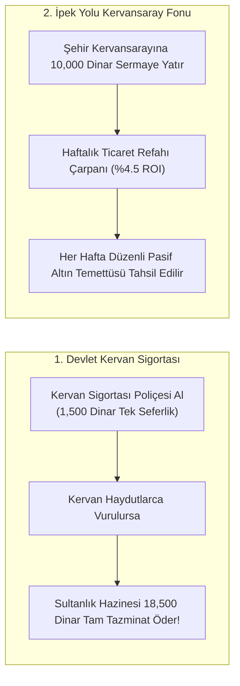

---

## ⚡ 3. Savaş Alanı FPS & Ragdoll Optimizasyon Motoru (BattleOptimizer)

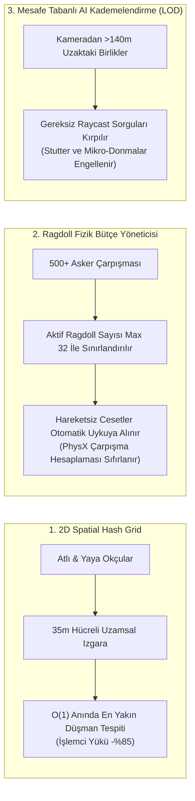

Not: Her iki sistem de (`BattlePerformanceOptimizer`, `TuranTacticMissionBehavior`/`ByzantineTacticMissionBehavior`)
sadece `mission.Mode == MissionMode.Battle` durumunda etkin. `TaleWorlds.Core.MissionMode` enum'unda
ayrı bir "Siege" değeri **yok** — kuşatma hücumları da `MissionMode.Battle` olarak çalışır, yani
`BattlePerformanceOptimizer` zaten hem tarla savaşlarında hem kuşatmalarda aktiftir (bu, v1.7.7'de
decompile ile doğrulandı — önceki bir turda "kuşatmalarda kapsanmıyor" şeklindeki hatalı iddia
düzeltildi). Sadece taktik doktrin FSM'leri ek olarak `!mission.IsSiegeBattle` şartı taşır ve bu
yüzden yalnız açık alan muharebelerinde çalışır (formasyon manevra AI'ı sur hücumuna uygun değildir).

---

## 🏹 4. Çok Doktrinli Reaktif Taktik Yapay Zeka Motoru (Multi-Doctrine Reactive AI)

Doktrin seçimi hâlâ savaşın başında aynı 4'e ayrılan mantıkla çalışıyor — ama v1.7.9-v1.8.1'de üç
ayrı oturumda yapılan (ve her birinde final incelemesinde gerçek, decompile ile doğrulanmış hatalar
bulunup düzeltilen) bir dizi geçişle, fazların **yürütülmesi** artık sabit bir senaryo değil:
`TacticalSituationAssessor` adlı, motordan tamamen bağımsız (sıfır `TaleWorlds.*` referansı), 43
birim testiyle kilitlenmiş paylaşılan bir karar katmanı, her 1.25 saniyede bir `Formation.
QuerySystem`'in zaten hesapladığı canlı muharebe verisini (kayıp oranı, yerel güç dengesi, düşman
bileşimi, gelen şarj tehdidi) okuyarak karar veriyor.

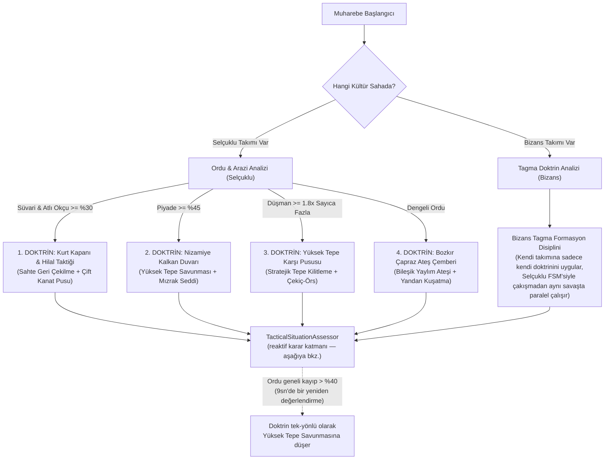

Her iki behavior da her tarla savaşına eklenir, ama her biri kendi kültürünün takımı sahada var mı diye
(`IsSeljukTeam`/`IsByzantineTeam`) kontrol edip sadece kendi hak ettiği tek takıma emir veriyor — bir
Selçuklu-Bizans savaşında ikisi de çakışmadan paralel çalışıyor.

### 4b. TacticalSituationAssessor — Birim Tipine Göre Reaktif Davranış

| Birim Tipi | Eski Davranış (v1.7.8'e kadar) | Yeni Davranış (v1.7.9-v1.8.1) |
| :--- | :--- | :--- |
| **Şok Süvarisi** | Faza girince koşulsuz şarj | Düşman mızrak/kalkan duvarı kurup duruyorsa (canlı hız verisiyle tespit) bekler; şarj kötü gidiyorsa (`kayıp > %35, güç dengesi aleyhte`) kontrollü geri çekilir |
| **Atlı Okçu** | Faz başında koşulsuz şarj, mermi bitince yakın dövüş | Mermi varken hep mesafe korur/vur-kaç yapar; mermi bitince yerel güce göre kovalar ya da çekilir |
| **Piyade** | Her savaşta koşulsuz kalkan duvarı, faz sonunda koşulsuz şarj | Kalkan duvarını sadece süvari tehdidi (atlı okçu dahil) ya da ok yağmuru altındayken kurar; ilerleyiş kaybediyorsa kontrollü çekilir; **gelen bir süvari şarjını (15sn içinde çarpacak) anında algılayıp duraklayıp kalkan duvarına geçer** (v1.8.1) |
| **Yaya Okçu** | Faz sonunda koşulsuz yakın dövüş şarjı | Atlı okçuyla birebir aynı mantığı kullanır (aynı test edilmiş fonksiyon, sadece kama formasyonu yerine gevşek dizilim) |

**Arazi seçimi (v1.8.1):** `TacticalFormationsHelper.FindOptimalHighGround` artık önce motorun
kendi `HighGroundCloseToForeseenBattleGround` eğim-arama sonucunu deniyor (öngörülen muharebe
hattına göre yönlenmiş, düşmana olan mesafeye göre ölçeklenen gerçek bir arazi analizi) — sadece
piyadesiz bir ordu ya da dejenere bir sonuç durumunda modun eski 8 noktalı sabit taramasına düşüyor.

Üçü de decompile ile doğrulanmış gerçek motor semantiğine dayanıyor — üç ayrı final incelemesi,
property isimlerinden varsayım yapmanın (`CasualtyRatio` aslında hayatta kalma oranı,
`MovementSpeedMaximum` aslında azami hız kapasitesi, `CavalryUnitRatio` atlı okçuları saymıyor)
gerçek hatalara yol açtığını üç kez ayrı ayrı kanıtladı; her seferinde bulunup düzeltildi.

---

## 👤 5. Selçuklu Karakter Yaratma Özgeçmiş Aşamaları

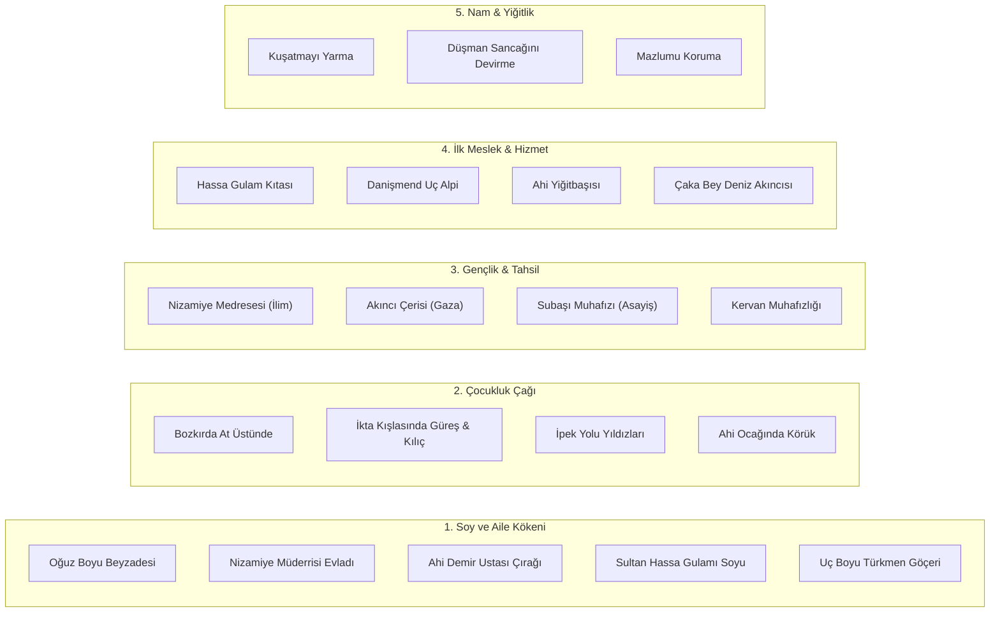

---

## 🌏 5b. Rakip Krallıkların Karakter Yaratma Özgeçmişleri (RivalCultureCharacterCreationContentHandler)

Selçuklu dışındaki 6 kültürün (Bizans, Abbasi, Gürcistan, Haçlı Devletleri, Kilikya Ermenistanı,
Karahanlı) her biri kendi 18 seçenekli (5 aile geçmişi + 4 çocukluk + 3 gençlik + 3 kariyer + 3
kahramanlık) tam özgeçmiş zincirine sahip — toplam 108 seçenek, 8 dilde tam çeviri ile.

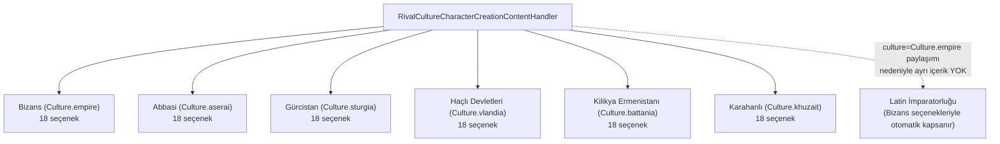

**Latin İmparatorluğu'nun neden ayrı özgeçmişi yok:** Kingdom.empire_w, Bizans ile aynı
`Culture.empire`'ı paylaşıyor ve özgeçmiş görünürlüğü krallığa değil kültüre göre belirleniyor —
yeni bir `is_main_culture` eklemek bu modun geçmişinde çökmeye yol açtığı için (bkz. bölüm 10),
mimari olarak ayrı içerik mümkün değil; Bizans seçenekleri zaten o oyuncuları kapsıyor.

---

## 👑 6. Krallık, Beylikler ve Tarihi Liderler Hiyerarşisi (Selçuklu)

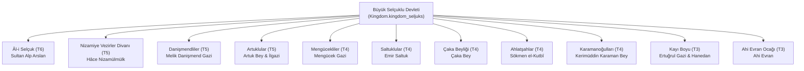

---

## 🗺️ 7. Şehirler, Kaleler ve Bağlı Köylerin Mülkiyet Dağılımı (Örnek — Selçuklu)

| Yerleşke Türü | Yerleşke Adı | Sahibi Olan Klan | Bağlı Köyler & Özel Üretim |
| :--- | :--- | :--- | :--- |
| **Şehir (Town)** | **Konya (town_ES1)** | Âl-i Selçuk (Alp Arslan) | Meram, Sille, Karatay |
| **Şehir (Town)** | **İsfahan (town_ES2)** | Âl-i Selçuk (Sultanlık Hassa Toprağı) | Juybareh, Lenban, Hasanabad |
| **Şehir (Town)** | **Söğüt (town_A2)** | Kayı Boyu (Ertuğrul) | Domaniç, Bozüyük |
| **Şehir (Town)** | **Nişabur (town_A4)** | Âl-i Selçuk (Sultanlık Hassa Toprağı) | Bostanabad, Şadyah, Kohandezh |
| **Şehir (Town)** | **Amasya (town_ES5)** | Danişmendliler (Bizans'tan alındı) | Merzifon, Taşova, Gümüşhacıköy |
| **Kale (Castle)** | **Lavenia Kalesi (castle_ES4)** | Danişmendliler | Lavenia |
| **Kale (Castle)** | **Şibal Zümr Kalesi (castle_A6)** | Artuklular | Şibal Zümr |
| **Kale (Castle)** | **Moreniya Kalesi (castle_ES5)** | Ahlatşahlar | Moreniya |
| **Kale (Castle)** | **Rey Kalesi (castle_A8)** | Âl-i Selçuk (Sultanlık Hassa Toprağı) | Çeşmedeh, Varamin |
| **Kale (Castle)** | **Eskişehir/Dorylaeum (castle_ES1)** | Kayı Boyu (Bizans'tan alındı) | Sivrihisar, Mihalıççık |

Bu tablo örnek amaçlıdır — modun tam yerleşke listesi için `ModuleData/settlements.xml` ve
sahiplik/mülkiyet runtime yönetimi için `Source/SeljukEmpire/Settlements/SeljukSettlementBehavior.cs`'e
bakınız.

---

## 🌍 8. Rakip Krallıklar Hiyerarşisi (Native Kingdom → Tarihi Devlet Dönüşümü)

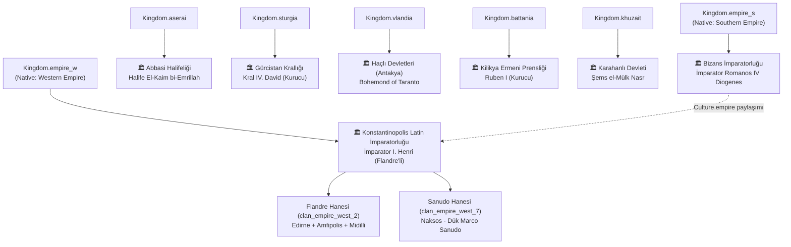

**Erken oturumlarda yapılan toprak transferleri:**
- Caleus Kalesi + köyleri (castle_V6): Haçlı Devletleri → Kilikya Ermeni Prensliği (Lampron, Oshin'in gerçek koltuğu)
- Amasya (+3 köy): Bizans → Selçuklu (Danişmendliler)
- Dorylaeum/Eskişehir (+2 köy): Bizans → Selçuklu (Kayı Boyu)
- Midilli (Lesbos): House Kontostephanos → Flandre Hanesi (settlement-level owner override)

**Bu oturumda tamamlanan içerik (v1.6.1 sonrası, bu segment):**
- **126 köy/kale yeniden adlandırması** — Haçlı Devletleri (41), Kilikya Ermenistanı (41), Karahanlı
  (44) krallıklarının şehir seviyesinde tamamlanmış ama köy/kale seviyesinde eksik kalan yeniden
  adlandırma çalışması bitirildi (Harim, Baghras, Samosata; Til Hamdoun, Korikos, Kızkalesi; Taşkent,
  Termez, Otrar gibi gerçek tarihi isimlerle), 8 dilde tam çeviri ile.
- **Anna Diogenissa (lord_1_37)** — Native'in "Ira"sı, artık erkek olan Romanos Diogenes'in
  (lord_1_14) kızı temasına uygun olarak yeniden adlandırıldı; eski "Rhagaea'nın kızı" çerçevesi
  sadece bir dev-yorumdaydı (oyun içi hiç görünmüyordu), ama isim uyumsuzluğu giderildi.
- **Atabeglik XP kapsam düzeltmesi** — `SeljukAtabegTitleBehavior` artık sadece gerçekten
  Selçuklu'ya ait bir yerleşimi yöneten Selçuklu klanı kahramanlarına günlük XP veriyor.

**Latin İmparatorluğu'nun kendine özgü 21 birimli asker ağacı** (`latin_empire_custom_troops.xml`,
Culture.empire, 6 kademe): Latin Levy → 4 dal (Frenk Piyadesi/Cenevizli Arbaletçi/Ulah Atlısı/
Silahtar) → ... → Gasmoulos Muhafızı (piyade), Seçkin Cenevizli Arbaletçi (menzilli), Rumeli Baronu
(ağır süvari) - Haçlı Devletleri'nin kendi ağacından tamamen farklı silah/zırh/at seçimleriyle. Diğer
6 rakip krallığın her birinin de kendi 21 birimlik özel ağacı var (7 x 21 = 147 rakip birim toplam).

**C# alt sistemleri (erken oturumlarda eklendi):**
- `LatinEmpireRecruitmentBehavior` - empire_w/empire_s'in paylaştığı Culture.empire nedeniyle
  Latin İmparatorluğu yerleşkelerinin varsayılan Bizans askeri yerine kendi lat2_ ağacını
  sunmasını sağlar (bkz. `SeljukRecruitmentBehavior` ile aynı desen).
- `NewKingdomsDialogueBehavior` - Haçlı (7), Ermeni (7), Karahanlı (9), Latin İmparatorluğu (2) ve
  Bizans Batı (7) olmak üzere 32 tarihi lorda özel, gerçek tarihe dayalı 70 satırlık diyalog
  ekler (3 varyantlı tekrar-önleme mekanizması `SeljukDialogueBehavior` ile aynı).

---

## 🍺 9. Meyhane Companion'ları — 25 Yoldaş (14 Tarihi + 11 Jenerik Selçuklu)

Mod artık toplam **25 meyhane companion'ı** taşıyor: 7 rakip kültürün her birine gerçek 11./12.
yüzyıl kişileriyle işlenmiş 2'şer companion (`rival_culture_companions.xml`, toplam 14) ve
Selçuklu'nun kendi 11 jenerik gezgin arketipi (`seljuk_special_characters.xml`, bölüm 9b). Her
ikisi de Native'in beklediği tüm `GameText` tanışma-diyaloğu içeriğiyle 8 dilde tam donanımlı.

### 9a. Gerçek Tarihi Yoldaşlar (rival_culture_companions.xml)

7 rakip kültürün her birine, Native'in jenerik `{FIRSTNAME} the X` şablonları yerine, **gerçek
11./12. yüzyıl kişileriyle** işlenmiş 2'şer companion eklendi (toplam 14) — beceri ve kişilik
özellikleri her birinin belgelenmiş gerçek hikâyesine göre ayarlandı.

```mermaid
graph TD
    RCC["rival_culture_companions.xml<br/>(14 companion, is_template=true)"] --> SEL["Selçuklu"]
    RCC --> BYZ2["Bizans"]
    RCC --> ABB2["Abbasi"]
    RCC --> GEO2["Gürcistan"]
    RCC --> CRUS2["Haçlı Devletleri"]
    RCC --> ARM2["Kilikya Ermenistanı"]
    RCC --> KRKH2["Karahanlı"]

    SEL --> S1["Nasir Khusraw<br/>(gezgin-şair → Scouting/Roguery)"]
    SEL --> S2["Ömer Hayyam<br/>(müneccim-matematikçi → Engineering)"]
    BYZ2 --> B1_["Michael Psellos<br/>(saray filozofu → Roguery/Charm)"]
    BYZ2 --> B2_["Roussel de Bailleul<br/>(Norman paralı asker → ağır süvari)"]
    ABB2 --> A1["Gazali<br/>(teolog-zahit → Steward/Charm)"]
    ABB2 --> A2["Usame bin Münkız<br/>(savaşçı-şair → OneHanded/Bow)"]
    GEO2 --> G1["İoane Petritsi<br/>(filozof-keşiş → Steward/Medicine)"]
    GEO2 --> G2["Svanetili Vardan<br/>(asi dağ beyi → Athletics/Bow)"]
    CRUS2 --> C1["Keşiş Piyer<br/>(vaiz → Charm/Roguery)"]
    CRUS2 --> C2["Bartholomeuslu Petrus<br/>(hacı-vizyoner → Charm/Medicine)"]
    ARM2 --> AR1["Urfalı Mateos<br/>(tarihçi-keşiş → Steward/Scouting)"]
    ARM2 --> AR2["Mıhitar Heratsi<br/>(hekim → Medicine 90)"]
    KRKH2 --> K1["Kaşgarlı Mahmud<br/>(dilbilimci-gezgin → Scouting/Steward)"]
    KRKH2 --> K2["Ahmed Yesevi<br/>(mutasavvıf → Charm/Steward)"]
```

**Motor doğrulaması (decompile ile teyit edildi):**
`TaleWorlds.CampaignSystem.CampaignBehaviors.CompanionsCampaignBehavior.InitializeCompanionTemplateList`
sadece `is_template="true" && Occupation.Wanderer` olan `CharacterObject`'leri tarıyor — sabit
`is_hero="true"` bir tanım hiçbir meyhanede hiç doğmazdı (sessiz, hatasız bir bütünleşme boşluğu
olurdu). `_aliveCompanionTemplates` bir `HashSet` olduğundan her şablondan aynı anda sadece 1 canlı
örnek var — yani her biri gerçekten "tek" bir karakter gibi davranıyor. `culture=` sadece
doğum/görünüm şablonunu belirliyor; Native'in kendi companion dağıtım mantığı kültür gözetmeksizin
rastgele şehirlere yerleştiriyor, yani herhangi biri herhangi bir krallığın meyhanesinde çıkabilir
(Native'in kendi roster'ı için de böyle — hata değil). Doğuş yaşı da XML'deki `age=` değil,
`AgeModel.HeroComesOfAge (18) + 5 + rastgele(0-11)` formülüyle 23-34 arası atanıyor, yani hiçbiri
asla çocuk olamıyor.

**v1.7.4 düzeltmesi — ilk tanışma diyaloğu hatası:** Yukarıdaki tanımlar sadece isim/skill/Traits/
Equipments/face içeriyordu; Native'in her wanderer için ayrıca beklediği 8 `GameText` kategorisi
(`prebackstory`, `backstory_a/b/c/d`, `response_1/2`, `generic_backstory` — `<kategori>.<companion_id>`
anahtarıyla) hiç tanımlanmamıştı, bu yüzden bir companion'la ilk konuşulduğunda ekranda doğrudan
`"ERROR: Text with id prebackstory doesn't exist! Variation: spc_wanderer_..."` görünüyordu (bkz.
bölüm 10, v1.6.7'deki aynı `GameTextManager` mekanizması). `rival_culture_companion_backstories.xml`
dosyasında 112 giriş (14 companion × 8 kategori) eklendi — her biri o companion'ın gerçek belgelenmiş
hikâyesine dayalı, Native'in kendi anlatı yapısıyla (giriş/gelişme/dönüm noktası/çözüm + 2 zıt oyuncu
yanıtı + kapanış) birebir uyumlu, 8 dilin hepsinde tam çeviriyle.

---

### 9b. Selçuklu'nun 11 Jenerik Gezgin Arketipi (seljuk_special_characters.xml)

`seljuk_special_characters.xml` içinde `spc_wanderer_seljuk_0`…`_10` id'leriyle tanımlı 11
generic wanderer, Native'in `spc_wanderer_khuzait_0`…`_10` arketiplerinin (bkz. Native'in kendi
`SkillSet.spc_wanderer_khuzait_N_skills` yorum satırları) Selçuklu/Türkmen-Bizans sınır boyu
temasına uyarlanmış karşılıkları: "Bilge" (bozkır alimi), "Şahin" (atlı okçu), "Babasız" (yetim
serseri), "Demirgöz" (nişancı), "Dışlanmış" (sürgün savaşçı), "Deli" (berserker), "Boz Şahin"
(veteran atlı okçu), "Dişi Kurt" (kadın savaşçı), "Yalnız" (tek başına hayatta kalan), "Çevik"
(haberci-öncü), "Perişan" (yoksul hayatta kalan).

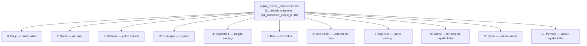

**v1.7.6 düzeltmesi — ikinci, ayrı bir GameText hatası:** v1.7.4'te 14 tarihi companion'ın
`GameText` eksikliği giderildikten sonra oyuncu, farklı iki karakterin ("Nafisa the Swift" /
`spc_wanderer_seljuk_9` ve "Al-Ghazali" / `spc_wanderer_aserai_ghazali`) tanışma diyaloğunda hâlâ
aynı `"ERROR: Text with id..."` metnini gösteren ekran görüntüleri paylaştı. İlk fix'in gerçekten
doğru çalıştığı özel bir C# test harness'iyle (`gtsim` — `GameTextManager.LoadFromXML`'i reflection
ile çağırıp kategori/companion-id kombinasyonlarını tüketen bir dotnet konsol projesi) kanıtlandıktan
sonra, bunun **ayrı, ikinci bir eksiklik** olduğu anlaşıldı: bu 11 jenerik gezgin, 14 tarihi
companion'ın aksine hiç `GameText` içeriği almamıştı. Yeni `seljuk_special_characters_backstories.xml`
dosyasında 88 giriş (11 × 8 kategori, `spc_wc2_<N>_<kategori>` anahtar deseniyle) eklendi — içerik
Native'in `wanderer_strings.xml`'indeki khuzait_0-10 arketiplerinden kopyalanmadan, Selçuklu/Türkmen-
Bizans sınır boyu temasına özgün olarak uyarlandı. v1.7.6'da sadece İngilizce/Türkçe eklendi;
**v1.7.8'de** kalan 6 dil (Almanca/Fransızca/İspanyolca/Rusça/Arapça/Çince) tamamlanarak 792 giriş
(99 anahtar × 8 dil) tam senkron hale getirildi — bu, `verify_mod.py`'nin bu oturumda ilk kez 0 hata
**VE** 0 uyarıyla geçtiği andı.

---

### 9c. Otomatik Bütünlük Denetleyicisi (tools/verify_mod.py)

Mod artık kendi 18 kontrollü, ~1450 satırlık Python doğrulama aracını taşıyor — her yayından önce
çalıştırılan bir CI-tarzı güvenlik ağı. v1.7.5-v1.7.7 arasında bu oturumda bulunan iki gerçek
regresyon sınıfını bir daha asla sessizce göndermemek için 2 yeni kontrol eklendi:

- **Check 14 — `wanderer-backstory-coverage` (ERROR):** `SubModule.xml`'deki tüm `id="GameText"`
  `XmlNode` yollarını tarar, her wanderer şablonu (`Hero.Template.StringId`) için 8 zorunlu
  kategoriyi (`prebackstory`, `backstory_a/b/c/d`, `response_1/2`, `generic_backstory`) kontrol
  eder — v1.7.4 ve v1.7.6'da bulunan iki `GameText` boşluğu sınıfını hedefler.
- **Check 15 — `culture-still-native` (ERROR + koşullu WARN):** Her 8 kültürün `basic_troop`,
  `caravan_guard`, `militia_party_template`, `rebels_party_template`, `settlement_patrol_template_
  level_1/2/3`, `vassal_reward_party_template` gibi attribute'larının hâlâ Native id'lerine işaret
  edip etmediğini denetler (ERROR); ayrıca Native'in gerçekten aynı kültür id'siyle
  `<basic_mercenary_troops>` tanımladığı kültürlerde (`load_native_cultures_with_basic_mercenary_
  troops`) `_replaceWhileMerging="true"` eksikse WARN üretir — bu ayrım, Seljuk gibi Native karşılığı
  olmayan kültürlerde yanlış pozitif üretmemek için özellikle eklendi (bkz. bölüm 10, v1.7.7).

- **Check 16 — `item-mesh-validity` (ERROR, v1.8.2):** Modun kendi tanımladığı her `<Item>`'ın
  `mesh=` değerinin, Native'in gerçekten kullandığı bir mesh'e karşılık geldiğini denetler. Mod hiç
  kendi 3B varlığı taşımıyor (`AssetPackages/` klasörü yok) — her eşya, `seljuk_royal_feather_helm`'in
  `khuzait_lord_helmet_a`'yı yeniden kullanması gibi, bilinçli olarak Native'in mevcut bir mesh'ini
  yeniden kullanıyor; bu yüzden listede olmayan bir `mesh=` neredeyse kesin bir yazım hatasıdır (oyunda
  görünmeyen/varsayılan geometri olarak render edilir, yükleme hatası vermez).
- **Check 17 — `dialogue-hero-ids` (ERROR, v1.8.2):** `Source/**/*.cs`'deki her
  `Hero.OneToOneConversationHero.StringId == "X"` koşulunu (bir özel diyalog satırının HANGİ
  karaktere ait olduğunu belirleyen mekanizma) tarar ve `X`'in gerçek bir Native veya mod-tanımlı
  karakter id'sine karşılık geldiğini doğrular. Yazım hatası burada hiç hata mesajı vermez — koşul
  sessizce hep yanlış olur, o karakter özel satırını asla göstermez ve fark edilmeden Native'in
  jenerik selamlamasına düşer. Aynı 3 dosyanın (bölüm 10, v1.8.2) `"lord_pretalk"` hatası
  denetlenirken bulundu; test sırasında 2 zararsız ama artık gereksiz OR-yedek id kontrolü de
  temizlendi (`ertugrul_gazi`/`lord_seljuk_nizamulmulk` zaten doğruydu, ikinci alternatif hiç
  gerçek değildi).
- **Check 18 — `banner-icon-usage` (ERROR + koşullu WARN, v1.8.3):** `TaleWorlds.Core.Banner.
  TryGetBannerDataFromCode` decompile edilip `banner_key`/`faction_banner_key`'in tam tel
  formatı (10'luk bloklar, her bloğun ilk alanı icon id) doğrulandı. (ERROR) modun kendi
  `<Icon id="X">`'i Native'in banner_icons.xml'inde zaten kullanılan bir id ile çakışamaz —
  bu tam çakışma sınıfı New Campaign ekranını daha önce gerçekten dondurmuş/çökertmişti
  (banner_icons.xml'in kendi başlık yorumuna bakın). (WARN) her özel icon en az bir
  banner_key/faction_banner_key'de kullanılmalı, yoksa `KNOWN_SPARE_BANNER_ICON_IDS`'te
  bilinçli yedek olarak belgelenmeli. İlk çalıştırmada 13 özel Selçuklu/Türk tamgasının
  **hiçbirinin** hiçbir klan/Kingdom/Culture'ın gerçek bayrağında kullanılmadığı bulundu —
  hepsi motora kayıtlıydı (bayrak düzenleyicide seçilebilir) ama hiçbiri varsayılan olarak
  gösterilmiyordu. 11'i artık ilgili klana atandı (6'sı isim eşleşmesiyle bire bir: Kayı
  Boyu/Çaka Beyliği/Saltuklular/Mengücekliler/Ahi Evran Ocağı/Âl-i Selçuk, kalan 5'i temaya
  göre); 2'si (Kızıl/Gök Sancak) bilinçli olarak serbest bayrak editörü seçeneği olarak
  kaldı.

**Yanlış alarm düzeltmeleri (bu oturumda, "fix" değil "düzelt" — gerçek bulgular):** İki önceki-tur
iddiası, gerçek motor decompile'ı ile yeniden doğrulanınca **yanlış** çıktı: (1) turnuva katılımcı
şablonları (`tournament_team_templates_one/two/four_participant`) — 6/7 rakip kültür Native'in
taban kültür id'sini paylaştığından, Native'in kendi kültüre-özel turnuva karakterleri zaten
doğru miras yoluyla çözülüyor; (2) `BattlePerformanceOptimizer`'ın kuşatmaları kapsamadığı iddiası —
`MissionMode` enum'unda ayrı bir Siege değeri yok, kuşatma hücumları da `MissionMode.Battle`. Her
ikisi de gereksiz "düzeltme" içeriği üretmek yerine kullanıcıya açıkça düzeltildi.

**v1.8.2'de prototiplenip geri çekilen bir kontrol:** Check 12'nin (skill puanı) silah karşılığı
olarak bir "silah gücü paritesi" kontrolü (`Item0`/`Item1`'in `thrust_damage`+`swing_damage`
toplamını tier medyanıyla karşılaştıran) gerçek mod verisiyle test edildi. Skill puanlarının aksine
(Native'in kendi tier eğrisi zaten normalize ediyor), ham silah hasarı aynı tier'deki farklı silah
TÜRLERİ arasında doğal olarak karşılaştırılabilir değil (bir arbalet, Bannerlord'un kendi tasarımı
gereği bir kılıçtan çok daha sert vurur, bu ateş hızıyla dengelenir, modun hatası değil) — gerçek
mod verisiyle çalıştırılınca 43 uyarı üretti ve bunların büyük çoğunluğu bu doğal varyanstan
kaynaklanıyordu, gerçek yazım hatası değil. Bu, aracın diğer tüm uyarılarına duyulan güveni
zedeleyecek gürültü olurdu, bu yüzden gönderilmeden geri çekildi — check 10-12 halihazırdaki sayısal
denge sinyali olarak kalıyor; gerçek bir silah-paritesi kontrolü tam DPS matematiği (isabet,
`speed_rating`, `weapon_length`) gerektirir, gelecekteki bir fikir olarak not edildi, zorla eklenmedi.

---

## 🩹 10. Sürüm Geçmişi — Kritik Düzeltmeler ve İçerik (v1.6.2 → v1.8.3)

```mermaid
graph LR
    V161["v1.6.1<br/>Workshop mini-fix"] --> V162["v1.6.2-1.6.4<br/>Çökme denemeleri<br/>(yanlış tanı)"]
    V162 --> V165["v1.6.5<br/>GERÇEK KÖK NEDEN:<br/>seljuk_culture.xml'deki<br/>&lt;cultural_feats&gt; bloğu"]
    V165 --> V166["v1.6.6<br/>Kültür seçim ekranı<br/>TEMP doku hatası düzeltildi"]
    V166 --> V167["v1.6.7<br/>16 kategori 'ERROR: Text<br/>with id...' GameText<br/>yer tutucusu süpürüldü"]
    V167 --> V170["v1.7.0<br/>3 krallığa özgeçmiş (108 seçenek) +<br/>14 tarihi companion + 126 yerleşke +<br/>Amasya/Eskişehir isim düzeltmesi"]
    V170 --> V171["v1.7.1<br/>7 rakip ağaçta 294 eksik<br/>Bacak/Eldiven zırhı dolduruldu +<br/>verify_mod.py'ye 3 denge kontrolü"]
    V171 --> V172["v1.7.2<br/>Lordların native ordusu:<br/>8 kültüre default_party_template<br/>bağlandı (turnuva/tutsak dahil)"]
    V172 --> V173["v1.7.3<br/>78 atlı birime upgrade_requires<br/>eklendi (atsız yükseltme kapatıldı)"]
    V173 --> V174["v1.7.4<br/>14 companion'ın 112 GameText<br/>girişi tamamlandı + 10 sabit<br/>mesaj {=key}'e taşındı"]
    V174 --> V175["v1.7.5<br/>Han paralı askeri/kervan-yerleşke<br/>muhafızı/devriye/kuşatma milisi/<br/>bağlılık hediyesi: 28 yeni şablon,<br/>artık native değil"]
    V175 --> V176["v1.7.6<br/>11 jenerik Selçuklu gezgininin<br/>İKİNCİ, ayrı GameText boşluğu<br/>kapatıldı (88 giriş, EN/TR)"]
    V176 --> V177["v1.7.7<br/>İsyancı/milis parti şablonu<br/>native'e sızıntısı fix (16 şablon) +<br/>verify_mod.py'ye 2 yeni kontrol +<br/>2 yanlış alarm iddiası düzeltildi"]
    V177 --> V178["v1.7.8<br/>11 gezginin 6 kalan dili<br/>tamamlandı (DE/FR/ES/RU/AR/CN,<br/>792 giriş) — 0 hata / 0 uyarı"]
    V178 --> V179["v1.7.9<br/>Reaktif süvari AI:<br/>TacticalSituationAssessor<br/>doğdu (24 test)"]
    V179 --> V180["v1.8.0<br/>Reaktif piyade & okçu AI<br/>(43 test)"]
    V180 --> V181["v1.8.1<br/>Cepheden şarj tepkisi +<br/>native arazi ustalığı"]
    V181 --> V182["v1.8.2<br/>8 kültüre Ansiklopedi metni +<br/>7 rakip krallığa turnuva şampiyonu<br/>ödülü + 117 lord/yoldaş selamlaması<br/>yanlış diyalog durumundan düzeltildi<br/>('lord_pretalk' → 'lord_start') +<br/>verify_mod.py check 16-17"]
    V182 --> V183["v1.8.3<br/>13 tamganın hiçbiri hiçbir klanda<br/>kullanılmıyordu, 11'i düzeltildi +<br/>7 yeni Abbasi/Gürcü lord selamlaması +<br/>verify_mod.py check 18 +<br/>run_all_checks.py + AI benchmark"]
```

- **v1.6.5 kök neden:** Bannerlord'da özel kültür feat'leri (Native'in aksine) mutlaka C#'ta
  `DefaultCulturalFeats`'e hardcode edilmeli — XML'de tanımlanan ama C#'ta kayıtlı olmayan bir feat
  id'si, null `Description`'lı bir stub `FeatObject` üretiyor ve `CharacterCreationCultureVM`
  kurucusu bunun üzerinde `.ToString()` çağırınca çöküyordu. Çözüm: `<cultural_feats>` bloğu
  tamamen kaldırıldı (gerçek maaş/inşaat/kervan bonusları zaten ayrı C# modellerinde).
- **v1.6.6 kök neden:** Modun kendi `GUI\SpriteSheets\` altına attığı özel doku, gerçek oyun
  içindeki `Texture.GetFromResource` aramasına görünmüyor (sadece Launcher'a görünüyor, farklı
  kaynak bağlamı). Çözüm: Karahanlı'nın zaten yüklü sprite koordinatlarına alias + `OverrideBrush=`
  ile ek stil.
- **v1.6.7 kök neden:** `TaleWorlds.Core.GameTextManager` (`GameTexts.FindText`), `TaleWorlds.
  Localization`'dan tamamen ayrı bir sistem — kayıt bulunamayınca null değil, ekranda görünen bir
  `"ERROR: Text with id X doesn't exist!"` metni döndürüyor. Native/StoryMode/SandBox'ın
  `.vlandia`/`.aserai` gibi kültür varyantı tanımladığı tüm kategoriler taranıp `.seljuk` karşılığı
  eklendi (16 kategori, ilk raporlanan 3'ün çok ötesinde).
- **v1.7.1 kök neden:** Bannerlord'un asker ücreti/alım maliyeti sadece Tier/Level'e bakıyor
  (decompile: `DefaultPartyWageModel.GetCharacterWage`/`GetTroopRecruitmentCost`,
  `DefaultCharacterStatsModel.GetTier => clamp(ceil((Level-5)/5),0,6)`), zırha bakmıyor — yani
  Selçuklu'nun ağacı %100 Bacak/Eldiven kaplarken 7 rakip ağacın %25-50'de kalması, aynı tier'de aynı
  maliyete yarı zırh demekti: sessiz ama gerçek bir denge hatası. 294 eksik slot her kültürün kendi
  Native taban kültüründen alınan tier-uygun eşyalarla dolduruldu; `verify_mod.py`'ye bunu bir daha
  yakalayacak `troop-armor-slots`/`troop-progression`/`troop-tier-parity` kontrolleri eklendi.
- **v1.7.2 kök neden (oyuncu tarafından bildirildi — Chaka Bey'in ordusu tamamen native Karahanlı
  askerinden oluşuyordu):** `LordPartyComponent`, her yeni lordun başlangıç rosterini
  `owner.Clan.DefaultPartyTemplate` → boşsa `Culture.DefaultPartyTemplate`'ten kuruyor (decompile ile
  doğrulandı). 8 kültürün hiçbirinde bu attribute set değildi — Selçuklu'nunki bile hâlâ Native'in
  `kingdom_hero_party_khuzait_template`'ine işaret eden eski bir yer tutucuydu. Sonuç: her lordun
  başlangıç ordusu (dolayısıyla turnuvalardaki ve haydut/tutsak kaynaklı askerlerin çoğu) hep Native
  askerlerinden oluşuyordu; sadece oyun başladıktan sonra alınan/yükseltilen askerler doğruydu. 8
  kültüre kendi ağacından inşa edilmiş yeni şablonlar bağlandı (`party_templates.xml`); Culture.empire'ı
  Bizans'la paylaşan Latin İmparatorluğu'nun 2 klanına ayrıca klan-seviyesi override eklendi.
- **v1.7.3 kök neden (oyuncu tarafından bildirildi — at olmadan atlı birliğe yükseltilebiliyordu):**
  Atlı yükseltmenin at-sahipliği kontrolü tamamen hedef birliğin kendi `upgrade_requires=
  "ItemCategory.X"` attribute'una bağlı (decompile: `DefaultPartyTroopUpgradeModel`,
  `CharacterObject.UpgradeRequiresItemFromCategory`) — modun sekiz dosyaya yayılan 78 atlı biriminin
  hiçbirinde bu attribute yoktu (grep: mod genelinde sıfır sonuç). Native'in kendi tier kuralına göre
  (orta kademe `ItemCategory.horse`, ağır süvari `ItemCategory.war_horse`) eklendi.
- **v1.7.4 kök neden (oyuncu tarafından bildirildi — companion diyaloğunda "ERROR: Text with id
  prebackstory doesn't exist!"):** 14 companion'ın sadece isim/skill/Traits/Equipments/face'i
  tanımlıydı; Native'in her wanderer için ayrıca beklediği 8 `GameText` kategorisi (`prebackstory`,
  `backstory_a/b/c/d`, `response_1/2`, `generic_backstory`) hiç yoktu — v1.6.7'deki aynı
  `GameTextManager` mekanizması (bkz. yukarı) burada da devreye girdi. 112 giriş (14×8), her biri
  companion'ın gerçek tarihine dayalı, 8 dilde eklendi (`rival_culture_companion_backstories.xml`).
  Ayrıca bu segmentte 10 sabit kodlanmış Türkçe oyun-içi mesaj (taktik AI çağrıları, kervan sigortası
  bildirimleri, turnuva mesajı) `{=key}` lokalizasyon sistemine taşındı.
- **v1.7.5 kök neden (oyuncu tarafından ekran görüntüsüyle bildirildi — hanlarda/kervanlarda/
  yerleşke devriyelerinde/kuşatma milislerinde/bağlılık hediyelerinde native asker çıkıyordu):**
  Decompile ile doğrulandı — `RecruitmentCampaignBehavior.UpdateCurrentMercenaryTroopAndCount`
  han paralı askerini `Culture.BasicMercenaryTroops`'tan (nested `<basic_mercenary_troops>`, `
  basic_troop` DEĞİL), kervan muhafızını `Culture.CaravanGuard`'dan besliyor; benzer şekilde
  devriye/kuşatma-milis/bağlılık-hediyesi partileri de her biri kendi `Culture` attribute'una
  (`settlement_patrol_template_level_1/2/3`, `vassal_reward_party_template`) bağlı — 8 kültürün
  hiçbirinde bunlar set edilmemişti. `MBObjectManager.MergeTwoXmls`'in `_replaceWhileMerging="true"`
  davranışı (elementin eski çocuklarını silip yenileriyle değiştirir) kullanılarak 6 rakip kültürün
  `<basic_mercenary_troops>` bloğu temiz biçimde override edildi; toplam 28 yeni `MBPartyTemplate`
  eklendi. Latin İmparatorluğu'nun Bizans'la `Culture.empire` paylaşımından doğan han/muhafız
  ayrımı, `TownMercenaryData`'nın hiçbir public alanla erişilebilir olmaması nedeniyle (Harmony
  kullanmadan) mimari olarak imkânsız — bilinen, kabul edilmiş bir sınırlama olarak belgelendi.
- **v1.7.6 kök neden (oyuncu ekran görüntüsüyle bildirildi — "Nafisa the Swift" ve "Al-Ghazali"
  tanışma diyaloğunda hâlâ "ERROR: Text with id..." görünüyordu):** v1.7.4'ün 14 tarihi companion
  fix'i özel bir test harness'iyle (`gtsim`) doğru olduğu kanıtlandıktan sonra, bunun **ayrı, ikinci
  bir GameText boşluğu** olduğu anlaşıldı — Selçuklu'nun 11 jenerik gezgini (`seljuk_special_
  characters.xml`) hiç `GameText` içeriği almamıştı. Yeni `seljuk_special_characters_backstories.xml`
  dosyasında 88 giriş (11×8, EN/TR) eklendi; ayrıca `verify_mod.py`'ye bu sınıf hatayı bir daha
  yakalayacak `wanderer-backstory-coverage` (check 14) kontrolü eklendi.
- **v1.7.7 kök neden (kullanıcı "genel neler eklenebilir" sorusuna verdiği önceliklendirme
  yanıtından):** Native'in `partyTemplates.xml`'i incelenince, isyancı (`rebels_party_template`) ve
  kuşatma-destek milis (`militia_party_template`) partilerinin — zaten fix'lenmiş `melee_militia_
  troop`/`ranged_militia_troop`'tan **ayrı** bir attribute olarak — hâlâ Native'in genel `imperial_
  recruit` tarzı askerlerinden kurulduğu görüldü; 8 kültüre kendi ağacından 16 yeni şablon (2'li
  milis + 3'lü isyancı yığını, Native'in 24-32/2-3/2-3 dağılımını yansıtarak) bağlandı.
  `verify_mod.py`'ye `culture-still-native` (check 15) eklendi — Native'in gerçek merge hedefi
  olduğu kültürlerde `_replaceWhileMerging` eksikliğini WARN, hâlâ native id'ye işaret eden herhangi
  bir attribute'u ERROR olarak yakalıyor. Bu turda ayrıca iki önceki-tur iddiası (turnuva şablonları,
  BattlePerformanceOptimizer'ın kuşatmaları kapsamadığı) gerçek decompile ile yeniden doğrulanıp
  **yanlış** bulundu ve gereksiz "düzeltme" içeriği üretmek yerine kullanıcıya açıkça düzeltildi.
- **v1.7.8 — kapanış:** 11 jenerik gezginin 6 kalan dili (DE/FR/ES/RU/AR/CN, 792 giriş) tamamlandı;
  `verify_mod.py`'nin 15 kontrolü bu oturumda ilk kez 0 hata **VE** 0 uyarıyla geçti. Steam
  Workshop'a konsoldan yayınlandı (item 3789607078).
- **v1.7.9 kök neden (oyuncu tarafından bildirildi — "atlılarla bodozlama düşmana kafa atıp atlıları
  kaybedip geri geliyorlar"):** `TuranTacticMissionBehavior`'ın taktik fazları tamamen sabit zaman/
  mesafe eşikleriyle çalışıyordu — atlı okçular faz başında koşulsuz şarj alıyordu, 4 doktrinin hepsi
  kuşatma fazına gelince aynı koşulsuz şarj koduna düşüyordu, hiçbir yerde kayıp oranı/düşman
  bileşimi okunmuyordu. Yeni, motordan bağımsız `TacticalSituationAssessor` katmanı yazıldı
  (`Formation.QuerySystem` — decompile ile doğrulandı). Final incelemesi 3 gerçek hata buldu ve
  düzeltti: `CasualtyRatio` aslında hayatta kalma oranıydı (her formasyon savaşın başında "yüksek
  kayıp" gibi okunuyordu), `MovementSpeedMaximum` azami hız *kapasitesiydi* (mızrak duvarı tespiti
  hiç tetiklenmiyordu), atlı okçu geri çekilme hedefi son verilen emrin konumunu kullanıyordu (harita
  kenarına doğru katlanarak uzaklaşıyordu).
- **v1.8.0 kök neden (kullanıcı isteğiyle — "aşırı iyi olsun" hedefiyle piyade/okçulara genişletildi):**
  Piyade her savaşta koşulsuz kalkan duvarı kurup faz sonunda koşulsuz şarj ediyordu; yaya okçular
  mermi bitince koşulsuz yakın dövüşe giriyordu — süvaride düzeltilen kusurun aynısı. Yaya okçular
  zaten test edilmiş `AssessHorseArcherStance`'i birebir yeniden kullandı; piyade için yeni
  `AssessInfantryStance` + `ShouldFormShieldWall` yazıldı (süvari tehdidi ya da ok yağmuru altında
  kalkan duvarı). Final incelemesi 2 gerçek hata buldu: `CavalryUnitRatio` atlı okçuları saymıyordu
  (motorun kendi `FormationClass.Cavalry`/`FormationClass.HorseArcher` ayrımı nedeniyle — modun
  imzası olan bozkır atlı okçusu tehdidi hiç algılanmıyordu), foot archer mevzi konumlandırması
  (12m arkada, cepheye dönük) silinmiş ama yerine hiçbir şey konmamıştı.
- **v1.8.1 kök neden (kullanıcı isteğiyle — motorun kullanılmayan iki sinyali):** `IsUnderCavalryChargeFromFront`
  (en yakın büyük düşman şok süvarisi mi, bize mi geliyor, cepheden mi, 15sn içinde mi çarpacak —
  hepsi decompile ile doğrulandı) piyadeye acil-durum kısa devresi olarak eklendi;
  `HighGroundCloseToForeseenBattleGround` (öngörülen muharebe hattına göre yönlenmiş gerçek eğim
  araması) `FindOptimalHighGround`'a tercih edilen yol olarak eklendi. Final incelemesi 1 kritik + 3
  önemli hata buldu: `Team.GetFormation` asla null dönmüyor (piyadesiz bir ordu, hiç tick almamış bir
  formasyonu doğrudan native aramaya besleyip haritanın köşesine anchor olabiliyordu), arama yarıçapı
  motor yolunda hiç uygulanmıyordu, sağlamlık kontrolü yanlış referans noktasıyla karşılaştırma
  yapıyordu, şarj tepkisi sadece iki fazda vardı (erken bir süvari hücumunun tam kaçırıldığı
  `StagingAndSkirmish` fazında yoktu). Hepsi aynı oturumda bulunup düzeltildi, sonra Steam
  Workshop'a (item 3789607078) canlı yayınlandı — Steam Web API ile doğrulandı.
- **v1.8.2, bölüm 1 (kullanıcının "modu her açıdan profesyonelce geliştir" önceliklendirmesinden):**
  Decompile ile `TaleWorlds.CampaignSystem.CultureObject.EncyclopediaText`'in `<Culture text=...>`
  attribute'undan geldiği doğrulandı (Native'in `khuzait` kültüründe zaten kullanılan bir alan);
  Seljuk'ta zaten vardı ama 6 rakip kültürün (`rival_culture_names.xml`) hiçbirinde yoktu — oyun içi
  Ansiklopedi'de hâlâ Native'in kendi Vlandia/Khuzait/vb. metnini gösteriyorlardı. 6 kültüre orijinal
  tarihi lore metni eklendi (8 dilde, 48 yeni string). `SeljukTournamentRewardBehavior`'ın sadece
  Selçuklu şehirlerini kapsadığı asimetrisi, yeni `RivalCultureTournamentRewardBehavior` ile
  giderildi — `settlement.OwnerClan.Kingdom.StringId` bazlı 7 rakip krallığın her birine, o kültürün
  kendi Native taban kültüründeki gerçek bir "lord tier" mesh'ini yeniden kullanan 1'er turnuva
  şampiyonu ödül eşyası eklendi (`items.xml`, 27 eşyaya çıktı); `Kingdom.empire_w` (Latin
  İmparatorluğu) ile `Kingdom.empire_s` (Bizans) `Culture.empire`'ı paylaşsa da farklı Kingdom id'leri
  taşıdıkları için farklı ödül eşyaları alabildi - char-creation seviyesinde imkânsız olan Latin/Bizans
  ayrımına mekanik bir katman eklendi (bkz. bölüm 5b). `verify_mod.py`'ye check 16
  (`item-mesh-validity`) eklendi. Aynı oturumda prototiplenen bir "silah gücü paritesi" kontrolü,
  gerçek veriyle 43 gürültülü uyarı ürettiği için dürüstçe geri çekildi (bkz. bölüm 9c). Ayrıca
  incelenen üç madde - kampanya haritası AI performansı (Harmony olmadan hiçbir güvenli hook yok,
  modun kendi C#'ı zaten sadece ucuz/seyrek event'ler kullanıyor, decompile+grep ile doğrulandı),
  evlilik mekaniği (Bannerlord'un vanilla evlilik sistemi zaten herhangi bir uygun companion/lord'u
  moddan bağımsız kapsıyor, ek kod gerekmiyor) ve 9. bir dil eklenmesi (mevcut 8 dilin her biri
  ~1750 anahtar taşıyor - aceleye getirilmiş bir çeviri turu kalite riski taşır) - gerçek bulgu
  olmadığı ya da ayrı bir oturumu hak ettiği için kullanıcıya açıkça bu şekilde raporlandı.
- **v1.8.2, bölüm 2 (kullanıcının "genel bir hata/bug taraması yap" isteğinden — decompile ile
  bulunan, önceki hiçbir sürümde raporlanmamış bir bulgu):** `TaleWorlds.CampaignSystem.CampaignBehaviors.
  LordConversationsCampaignBehavior`'ın kendisi decompile edilip Native'in KENDİ "start" durumundan
  çıkan HER lord selamlama satırı incelendi (`start_default`, `parley_2`, `start_attacking_met` vb.)
  — hepsi istisnasız `"start"` girdisinden `"lord_start"` çıktısına gidiyor, `"lord_pretalk"`'a giden
  SIFIR örnek var. Modun kendi 3 diyalog dosyası (`SeljukDialogueBehavior`,
  `RivalCultureDialogueBehavior`, `NewKingdomsDialogueBehavior` — 32+ tarihi lord/yoldaşın TÜM özel
  selamlamaları) ise **117 satırın hepsinde** `"start" → "lord_pretalk"` kullanıyordu. Etkisi:
  `lord_pretalk`'ın tek koşulsuz devamı `"Is there anything else?"` (native'in kendisi bunu farklı,
  ara durumlardan gelen bir takip cümlesi olarak kullanıyor) - yani her özel selamlamadan hemen sonra
  bağlamsız, tuhaf bir satır gösteriliyor ve Native'in `lord_start`'tan gelen kendi ortam
  yorumlarının hepsi atlanıyordu (konuşma çökmüyordu, sadece hep bu garip ekstra adımdan geçiyordu -
  klasik "sessiz, hatasız ama yanlış" hata sınıfı). 117 satırın hepsinde `"lord_pretalk"` →
  `"lord_start"` düzeltildi (tek, tutarlı string replace, build 0 hata). Aynı denetim sırasında,
  `Hero.OneToOneConversationHero.StringId` karşılaştırmalarının tamamı (52 benzersiz id) Native +
  mod karakter id'lerine karşı çapraz kontrol edildi — 50'si geçerliydi, 2'si (`lord_seljuk_
  ertugrul_gazi`, `lord_seljuk_nizam_al_mulk`) zaten doğru bir id ile OR'lanmış zararsız ama gereksiz
  yedek kontrollerdi, temizlendi. `verify_mod.py`'ye bu tam bulgu sınıfını (yazım hatalı/geçersiz
  `Hero.StringId` koşulu) bir daha yakalayacak check 17 (`dialogue-hero-ids`) eklendi.
- **v1.8.3 (kullanıcının "daha fazla öneri" turundan seçtiği 5 madde):** `dotnet test` +
  `verify_mod.py` tek `tools/run_all_checks.py` komutunda birleştirildi (pre-commit hook ve
  README güncellendi). `TacticalSituationAssessor` için gerçek bir mikro-benchmark eklendi
  (`Source/SeljukEmpire.Benchmarks/`, aynı motor-bağımsız desen) — ölçülen sonuç: en pahalı
  çağrı ~30ns, throttle'lı tick başına (12 formasyon × 2 takım, kötü senaryo) ~0.7µs, 60fps'lik
  bir frame'in **%0.004**'ü, 75 frame'de bir. `TaleWorlds.Core.Banner.TryGetBannerDataFromCode`
  decompile edilip `banner_key` tel formatı doğrulandı — bu, 13 özel Selçuklu tamgasının
  **hiçbirinin** hiçbir klanın/Kingdom'ın/Culture'ın gerçek bayrağında kullanılmadığını ortaya
  çıkardı (motora kayıtlı ama görünmez). 11 tamga ilgili klana atandı, `verify_mod.py`'ye check
  18 eklendi. Abbasi (3) ve Gürcistan'ın (4) kalan isimli lordlarına — küçük kültürlerin son
  "jenerik" kalan lordları — 3. dalga selamlama satırları eklendi (8 dilde). Steam mağaza
  açıklaması (EN+TR) 25 companion, reaktif AI, 8 krallığın turnuva ödülü ve Ansiklopedi
  içeriğini yansıtacak şekilde konsoldan güncellendi (sadece metadata, içerik yeniden
  yüklenmedi).

Tüm kritik motor bulguları ve gelecekteki oturumlar için not edilen tuzaklar için proje hafızasına
bakınız (`project_ottoman_janissaries_mod.md`).
