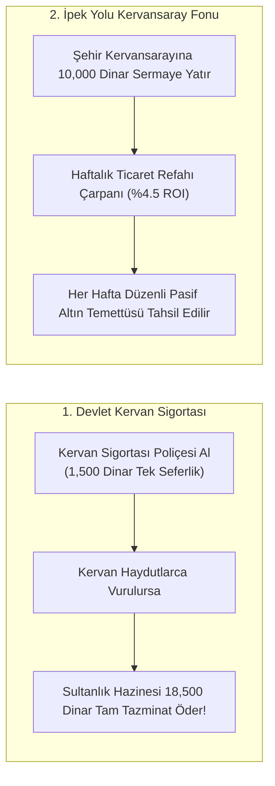
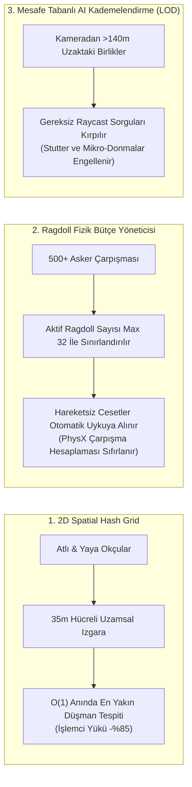
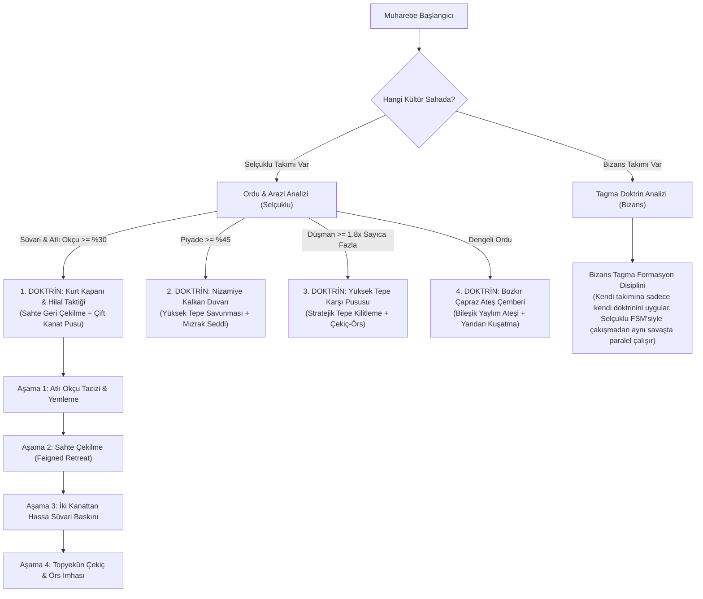
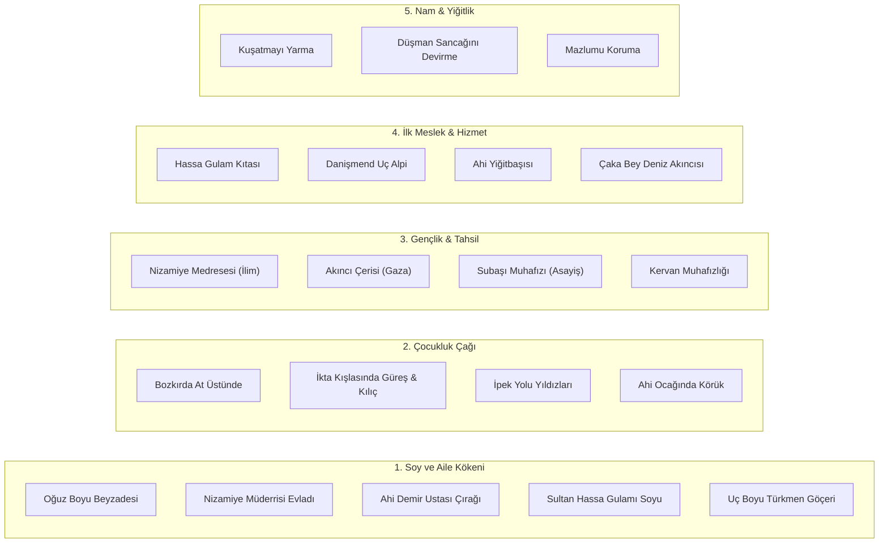
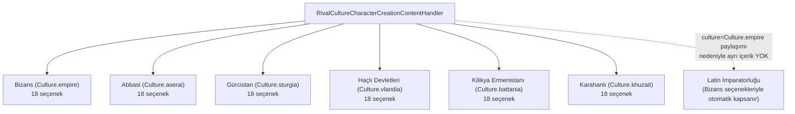
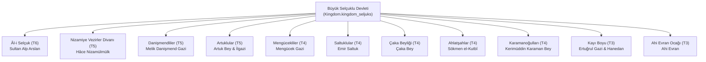
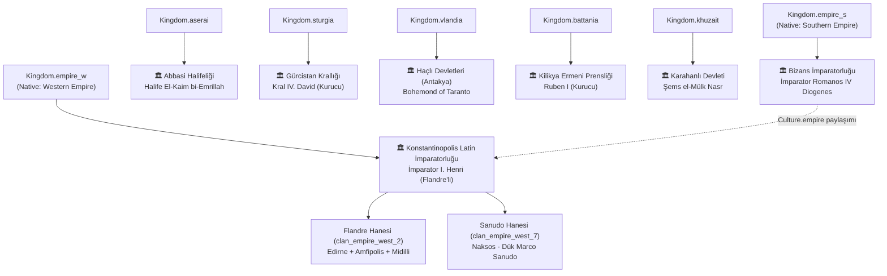
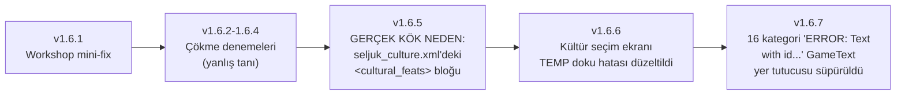

# Seljuk Empire: Sword of Islam — Mod Mimari & Bağlantı Grafiği (Architecture Graph)

Bu doküman, **"Seljuk Empire: Sword of Islam"** total conversion modundaki tüm modüllerin, C# çok
doktrinli taktik yapay zeka motorunun, BattlePerformanceOptimizer FPS sisteminin, **Selçuklu Kervan
Devlet Sigortası & İpek Yolu Kâr Ortaklığı sisteminin**, 8 krallığın (Selçuklu + 7 rakip), klan, lord,
yerleşke, birlik ağaçları, karakter yaratma özgeçmişleri, meyhane companion'ları, eşyalar, politikalar
ve 8 dil desteği arasındaki ilişkileri detaylandırmaktadır. **Güncel sürüm: v1.6.7.**

---

## 🏗️ 1. Genel Modül & Dosya Bağımlılık Haritası (Master Engine Architecture)

```mermaid
graph TD
    SM["SubModule.xml<br/>(Master Manifest, ~45 XmlNode)"] --> CSHARP["SeljukTactics.dll<br/>(19 C# Kaynak Dosyası)"]
    SM --> XML_CC["seljuk_character_creation_equipment.xml<br/>+ seljuk_education_*<br/>(Selçuklu 5 Aşamalı Özgeçmiş)"]
    SM --> XML_F["factions.xml + kingdoms.xml<br/>(8 Krallık: Selçuklu + 7 Rakip)"]
    SM --> XML_S["8 x *_settlements.xml<br/>(390 Şehir/Kale/Köy Yeniden Adlandırması)"]
    SM --> XML_L["8 x *_lords.xml<br/>(Tüm Krallıklarda Tarihi Lord İsimleri)"]
    SM --> XML_H["heroes.xml + rival_culture_companions.xml<br/>(Soy Ağacı & 14 Tarihi Meyhane Yoldaşı)"]
    SM --> XML_T["8 x *_troops.xml / *_custom_troops.xml<br/>(Selçuklu Ağacı + 7 Rakip Krallığın 21'er Birimlik Ağacı = 147 Birim)"]
    SM --> XML_P["party_templates.xml<br/>(Ordu Şablonları)"]
    SM --> XML_POL["policies.xml<br/>(10 Özel Selçuklu Politikası)"]
    SM --> XML_I["items.xml<br/>(12 Efsanevi Yadigar)"]
    SM --> XML_B["banner_icons.xml<br/>(11 Selçuklu Tamgası)"]
    SM --> XML_LANG["Languages/<br/>(EN/TR/DE/FR/ES/RU/AR/CN — 8 Dil Tam Senkron)"]

    CSHARP --> TACTIC_AI["TuranTacticMissionBehavior<br/>(4 Doktrinli Selçuklu Taktik FSM)"]
    CSHARP --> TACTIC_BYZ["ByzantineTacticMissionBehavior<br/>(Bizans Tagma Taktik FSM)"]
    CSHARP --> TACTIC_MATH["TacticalFormationsHelper<br/>(Sıfır-GC Tepe & Sınır Güvenliği)"]
    CSHARP --> PERF_OPT["BattlePerformanceOptimizer<br/>+ RagdollPhysicsBudgetManager<br/>(FPS & Frametime Dengeleyici, sadece tarla savaşları)"]
    CSHARP --> ECON_INS["SeljukCaravanInsuranceBehavior<br/>(Devlet Sigortası & İpek Yolu Fonu)"]
    CSHARP --> ADMIN["SeljukAtabegTitleBehavior<br/>(Atabeglik XP — sadece Selçuklu yerleşimi yöneten valilere)"]
    CSHARP --> SETTLE["SeljukSettlementBehavior<br/>(Selçuklu mülkiyet/sahiplik runtime yönetimi)"]
    CSHARP --> RECRUIT["SeljukRecruitmentBehavior<br/>+ LatinEmpireRecruitmentBehavior<br/>(Culture.empire paylaşımı sorunu için özel askere alma mantığı)"]
    CSHARP --> TAVERN["SeljukTavernBehavior<br/>(Ozan/moral sistemi)"]
    CSHARP --> DIALOG["SeljukDialogueBehavior + RivalCultureDialogueBehavior<br/>+ NewKingdomsDialogueBehavior<br/>(32+ tarihi lorda özel diyalog)"]
    CSHARP --> EXPLAIN["SeljukSystemsExplainerBehavior<br/>(Yeni oyuncu için sistem tanıtımı)"]
    CSHARP --> TOURNEY["SeljukTournamentRewardBehavior"]
    CSHARP --> CULTBONUS["SeljukCultureBonusBehavior<br/>(SeljukWageModel/ConstructionSpeedModel/<br/>SiegeEngineeringModel/CaravanTradeModel)"]
    CSHARP --> CHARGEN["SeljukCharacterCreationContentHandler<br/>+ RivalCultureCharacterCreationContentHandler<br/>(7 kültürde özgeçmiş içeriği)"]
```

---

## 🪙 2. Selçuklu Kervan Devlet Sigortası & İpek Yolu Kâr Ortaklığı (Economy Engine)

---

## ⚡ 3. Savaş Alanı FPS & Ragdoll Optimizasyon Motoru (BattleOptimizer)

Not: Her iki sistem de (`BattlePerformanceOptimizer`, `TuranTacticMissionBehavior`/`ByzantineTacticMissionBehavior`)
sadece `mission.Mode == MissionMode.Battle` durumunda etkin; taktik doktrin FSM'leri ayrıca
`!mission.IsSiegeBattle` şartıyla sadece açık alan muharebelerinde çalışır (kuşatmalarda devre dışı).

---

## 🏹 4. Çok Doktrinli Taktik Yapay Zeka Motoru (Multi-Doctrine AI)

Her iki behavior da her tarla savaşına eklenir, ama her biri kendi kültürünün takımı sahada var mı diye
(`IsSeljukTeam`/`IsByzantineTeam`) kontrol edip sadece kendi hak ettiği tek takıma emir veriyor — bir
Selçuklu-Bizans savaşında ikisi de çakışmadan paralel çalışıyor.

---

## 👤 5. Selçuklu Karakter Yaratma Özgeçmiş Aşamaları

---

## 🌏 5b. Rakip Krallıkların Karakter Yaratma Özgeçmişleri (RivalCultureCharacterCreationContentHandler)

Selçuklu dışındaki 6 kültürün (Bizans, Abbasi, Gürcistan, Haçlı Devletleri, Kilikya Ermenistanı,
Karahanlı) her biri kendi 18 seçenekli (5 aile geçmişi + 4 çocukluk + 3 gençlik + 3 kariyer + 3
kahramanlık) tam özgeçmiş zincirine sahip — toplam 108 seçenek, 8 dilde tam çeviri ile.

**Latin İmparatorluğu'nun neden ayrı özgeçmişi yok:** Kingdom.empire_w, Bizans ile aynı
`Culture.empire`'ı paylaşıyor ve özgeçmiş görünürlüğü krallığa değil kültüre göre belirleniyor —
yeni bir `is_main_culture` eklemek bu modun geçmişinde çökmeye yol açtığı için (bkz. bölüm 10),
mimari olarak ayrı içerik mümkün değil; Bizans seçenekleri zaten o oyuncuları kapsıyor.

---

## 👑 6. Krallık, Beylikler ve Tarihi Liderler Hiyerarşisi (Selçuklu)

---

## 🗺️ 7. Şehirler, Kaleler ve Bağlı Köylerin Mülkiyet Dağılımı (Örnek — Selçuklu)

| Yerleşke Türü | Yerleşke Adı | Sahibi Olan Klan | Bağlı Köyler & Özel Üretim |
| :--- | :--- | :--- | :--- |
| **Şehir (Town)** | **Konya (town_ES1)** | Âl-i Selçuk (Alp Arslan) | Meram, Sille, Karatay |
| **Şehir (Town)** | **İsfahan (town_ES2)** | Âl-i Selçuk (Sultanlık Hassa Toprağı) | Juybareh, Lenban, Hasanabad |
| **Şehir (Town)** | **Söğüt (town_A2)** | Kayı Boyu (Ertuğrul) | Domaniç, Bozüyük |
| **Şehir (Town)** | **Nişabur (town_A4)** | Âl-i Selçuk (Sultanlık Hassa Toprağı) | Bostanabad, Şadyah, Kohandezh |
| **Şehir (Town)** | **Amasya (town_ES5)** | Danişmendliler (Bizans'tan alındı) | Merzifon, Taşova, Gümüşhacıköy |
| **Kale (Castle)** | **Lavenia Kalesi (castle_ES4)** | Danişmendliler | Lavenia |
| **Kale (Castle)** | **Şibal Zümr Kalesi (castle_A6)** | Artuklular | Şibal Zümr |
| **Kale (Castle)** | **Moreniya Kalesi (castle_ES5)** | Ahlatşahlar | Moreniya |
| **Kale (Castle)** | **Rey Kalesi (castle_A8)** | Âl-i Selçuk (Sultanlık Hassa Toprağı) | Çeşmedeh, Varamin |
| **Kale (Castle)** | **Eskişehir/Dorylaeum (castle_ES1)** | Kayı Boyu (Bizans'tan alındı) | Sivrihisar, Mihalıççık |

Bu tablo örnek amaçlıdır — modun tam yerleşke listesi için `ModuleData/settlements.xml` ve
sahiplik/mülkiyet runtime yönetimi için `Source/SeljukEmpire/Settlements/SeljukSettlementBehavior.cs`'e
bakınız.

---

## 🌍 8. Rakip Krallıklar Hiyerarşisi (Native Kingdom → Tarihi Devlet Dönüşümü)

**Erken oturumlarda yapılan toprak transferleri:**
- Caleus Kalesi + köyleri (castle_V6): Haçlı Devletleri → Kilikya Ermeni Prensliği (Lampron, Oshin'in gerçek koltuğu)
- Amasya (+3 köy): Bizans → Selçuklu (Danişmendliler)
- Dorylaeum/Eskişehir (+2 köy): Bizans → Selçuklu (Kayı Boyu)
- Midilli (Lesbos): House Kontostephanos → Flandre Hanesi (settlement-level owner override)

**Bu oturumda tamamlanan içerik (v1.6.1 sonrası, bu segment):**
- **126 köy/kale yeniden adlandırması** — Haçlı Devletleri (41), Kilikya Ermenistanı (41), Karahanlı
  (44) krallıklarının şehir seviyesinde tamamlanmış ama köy/kale seviyesinde eksik kalan yeniden
  adlandırma çalışması bitirildi (Harim, Baghras, Samosata; Til Hamdoun, Korikos, Kızkalesi; Taşkent,
  Termez, Otrar gibi gerçek tarihi isimlerle), 8 dilde tam çeviri ile.
- **Anna Diogenissa (lord_1_37)** — Native'in "Ira"sı, artık erkek olan Romanos Diogenes'in
  (lord_1_14) kızı temasına uygun olarak yeniden adlandırıldı; eski "Rhagaea'nın kızı" çerçevesi
  sadece bir dev-yorumdaydı (oyun içi hiç görünmüyordu), ama isim uyumsuzluğu giderildi.
- **Atabeglik XP kapsam düzeltmesi** — `SeljukAtabegTitleBehavior` artık sadece gerçekten
  Selçuklu'ya ait bir yerleşimi yöneten Selçuklu klanı kahramanlarına günlük XP veriyor.

**Latin İmparatorluğu'nun kendine özgü 21 birimli asker ağacı** (`latin_empire_custom_troops.xml`,
Culture.empire, 6 kademe): Latin Levy → 4 dal (Frenk Piyadesi/Cenevizli Arbaletçi/Ulah Atlısı/
Silahtar) → ... → Gasmoulos Muhafızı (piyade), Seçkin Cenevizli Arbaletçi (menzilli), Rumeli Baronu
(ağır süvari) - Haçlı Devletleri'nin kendi ağacından tamamen farklı silah/zırh/at seçimleriyle. Diğer
6 rakip krallığın her birinin de kendi 21 birimlik özel ağacı var (7 x 21 = 147 rakip birim toplam).

**C# alt sistemleri (erken oturumlarda eklendi):**
- `LatinEmpireRecruitmentBehavior` - empire_w/empire_s'in paylaştığı Culture.empire nedeniyle
  Latin İmparatorluğu yerleşkelerinin varsayılan Bizans askeri yerine kendi lat2_ ağacını
  sunmasını sağlar (bkz. `SeljukRecruitmentBehavior` ile aynı desen).
- `NewKingdomsDialogueBehavior` - Haçlı (7), Ermeni (7), Karahanlı (9), Latin İmparatorluğu (2) ve
  Bizans Batı (7) olmak üzere 32 tarihi lorda özel, gerçek tarihe dayalı 70 satırlık diyalog
  ekler (3 varyantlı tekrar-önleme mekanizması `SeljukDialogueBehavior` ile aynı).

---

## 🍺 9. Meyhane Companion'ları — Gerçek Tarihi Yoldaşlar (rival_culture_companions.xml)

7 rakip kültürün her birine, Native'in jenerik `{FIRSTNAME} the X` şablonları yerine, **gerçek
11./12. yüzyıl kişileriyle** işlenmiş 2'şer companion eklendi (toplam 14) — beceri ve kişilik
özellikleri her birinin belgelenmiş gerçek hikâyesine göre ayarlandı.

```mermaid
graph TD
    RCC["rival_culture_companions.xml<br/>(14 companion, is_template=true)"] --> SEL["Selçuklu"]
    RCC --> BYZ2["Bizans"]
    RCC --> ABB2["Abbasi"]
    RCC --> GEO2["Gürcistan"]
    RCC --> CRUS2["Haçlı Devletleri"]
    RCC --> ARM2["Kilikya Ermenistanı"]
    RCC --> KRKH2["Karahanlı"]

    SEL --> S1["Nasir Khusraw<br/>(gezgin-şair → Scouting/Roguery)"]
    SEL --> S2["Ömer Hayyam<br/>(müneccim-matematikçi → Engineering)"]
    BYZ2 --> B1_["Michael Psellos<br/>(saray filozofu → Roguery/Charm)"]
    BYZ2 --> B2_["Roussel de Bailleul<br/>(Norman paralı asker → ağır süvari)"]
    ABB2 --> A1["Gazali<br/>(teolog-zahit → Steward/Charm)"]
    ABB2 --> A2["Usame bin Münkız<br/>(savaşçı-şair → OneHanded/Bow)"]
    GEO2 --> G1["İoane Petritsi<br/>(filozof-keşiş → Steward/Medicine)"]
    GEO2 --> G2["Svanetili Vardan<br/>(asi dağ beyi → Athletics/Bow)"]
    CRUS2 --> C1["Keşiş Piyer<br/>(vaiz → Charm/Roguery)"]
    CRUS2 --> C2["Bartholomeuslu Petrus<br/>(hacı-vizyoner → Charm/Medicine)"]
    ARM2 --> AR1["Urfalı Mateos<br/>(tarihçi-keşiş → Steward/Scouting)"]
    ARM2 --> AR2["Mıhitar Heratsi<br/>(hekim → Medicine 90)"]
    KRKH2 --> K1["Kaşgarlı Mahmud<br/>(dilbilimci-gezgin → Scouting/Steward)"]
    KRKH2 --> K2["Ahmed Yesevi<br/>(mutasavvıf → Charm/Steward)"]
```

**Motor doğrulaması (decompile ile teyit edildi):**
`TaleWorlds.CampaignSystem.CampaignBehaviors.CompanionsCampaignBehavior.InitializeCompanionTemplateList`
sadece `is_template="true" && Occupation.Wanderer` olan `CharacterObject`'leri tarıyor — sabit
`is_hero="true"` bir tanım hiçbir meyhanede hiç doğmazdı (sessiz, hatasız bir bütünleşme boşluğu
olurdu). `_aliveCompanionTemplates` bir `HashSet` olduğundan her şablondan aynı anda sadece 1 canlı
örnek var — yani her biri gerçekten "tek" bir karakter gibi davranıyor. `culture=` sadece
doğum/görünüm şablonunu belirliyor; Native'in kendi companion dağıtım mantığı kültür gözetmeksizin
rastgele şehirlere yerleştiriyor, yani herhangi biri herhangi bir krallığın meyhanesinde çıkabilir
(Native'in kendi roster'ı için de böyle — hata değil). Doğuş yaşı da XML'deki `age=` değil,
`AgeModel.HeroComesOfAge (18) + 5 + rastgele(0-11)` formülüyle 23-34 arası atanıyor, yani hiçbiri
asla çocuk olamıyor.

---

## 🩹 10. Sürüm Geçmişi — Kritik Düzeltmeler (v1.6.2 → v1.6.7)

- **v1.6.5 kök neden:** Bannerlord'da özel kültür feat'leri (Native'in aksine) mutlaka C#'ta
  `DefaultCulturalFeats`'e hardcode edilmeli — XML'de tanımlanan ama C#'ta kayıtlı olmayan bir feat
  id'si, null `Description`'lı bir stub `FeatObject` üretiyor ve `CharacterCreationCultureVM`
  kurucusu bunun üzerinde `.ToString()` çağırınca çöküyordu. Çözüm: `<cultural_feats>` bloğu
  tamamen kaldırıldı (gerçek maaş/inşaat/kervan bonusları zaten ayrı C# modellerinde).
- **v1.6.6 kök neden:** Modun kendi `GUI\SpriteSheets\` altına attığı özel doku, gerçek oyun
  içindeki `Texture.GetFromResource` aramasına görünmüyor (sadece Launcher'a görünüyor, farklı
  kaynak bağlamı). Çözüm: Karahanlı'nın zaten yüklü sprite koordinatlarına alias + `OverrideBrush=`
  ile ek stil.
- **v1.6.7 kök neden:** `TaleWorlds.Core.GameTextManager` (`GameTexts.FindText`), `TaleWorlds.
  Localization`'dan tamamen ayrı bir sistem — kayıt bulunamayınca null değil, ekranda görünen bir
  `"ERROR: Text with id X doesn't exist!"` metni döndürüyor. Native/StoryMode/SandBox'ın
  `.vlandia`/`.aserai` gibi kültür varyantı tanımladığı tüm kategoriler taranıp `.seljuk` karşılığı
  eklendi (16 kategori, ilk raporlanan 3'ün çok ötesinde).

Tüm kritik motor bulguları ve gelecekteki oturumlar için not edilen tuzaklar için proje hafızasına
bakınız (`project_ottoman_janissaries_mod.md`).
